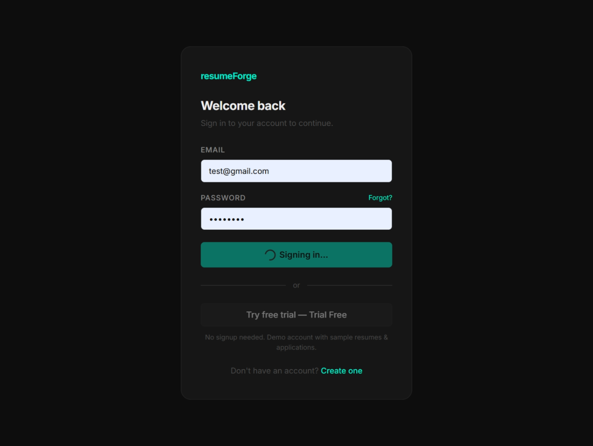
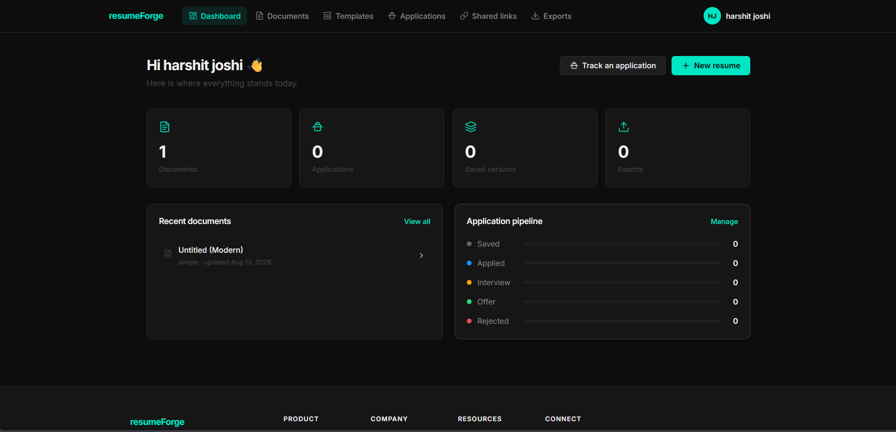
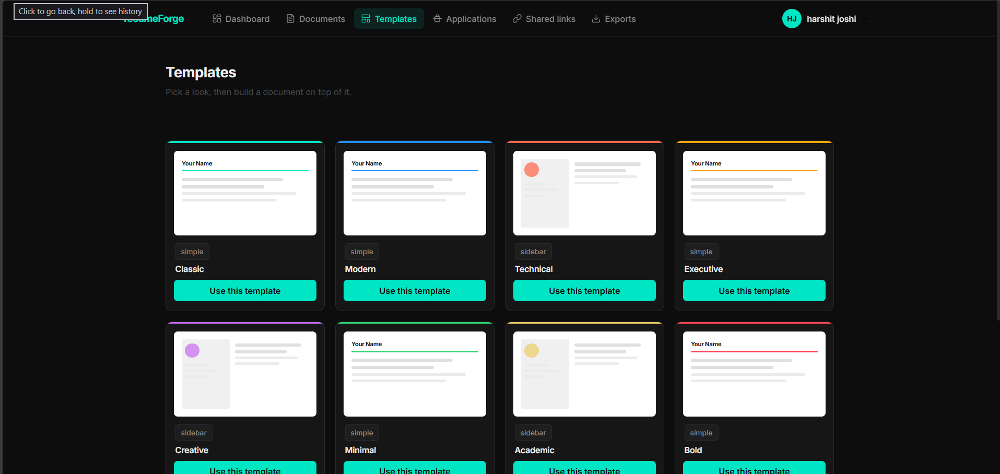
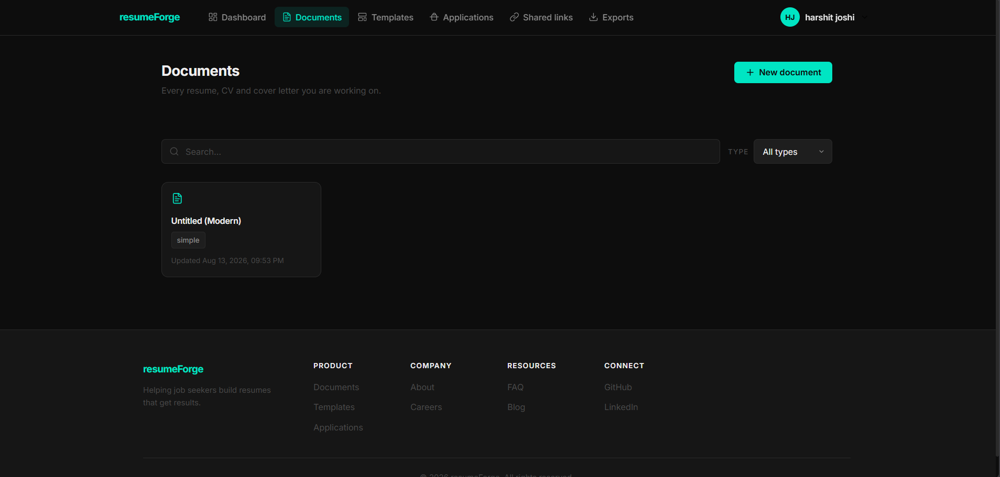
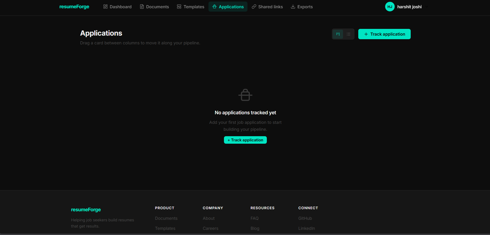
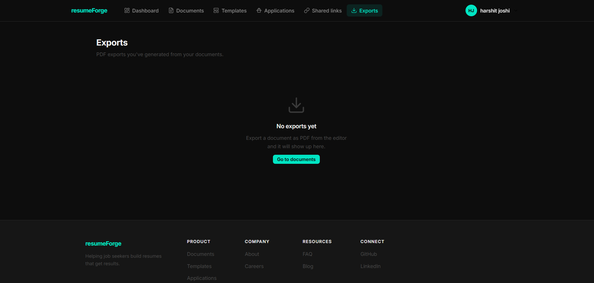

# resumeForge

**Helping job seekers build resumes that get results.**

resumeForge is a SaaS platform designed for **students, teachers, and freshers** to create professional, job-specific resumes quickly and track their job applications in one place.

---

## ✨ Features

- **Resume Builder** — Create resumes tailored to specific job roles using ready-made templates.
- **Templates Library** — Choose from multiple resume styles:
  - Classic (simple)
  - Modern (simple)
  - Technical (sidebar)
  - Executive (simple)
  - Creative (sidebar)
  - Minimal (simple)
  - Academic (sidebar)
  - Bold (simple)
- **Dashboard** — Get a quick overview of your documents, applications, saved versions, and exports at a glance.
- **Application Tracking** — Track every job application through its full lifecycle:
  - Saved → Applied → Interview → Offer → Rejected
- **Document Management** — View, edit, and manage all your resume versions from one place.
- **Shared Links** — Share your resume with recruiters or mentors via a link.
- **Exports** — Download your resume in ready-to-send formats.

---

## 🎯 Who is it for?

- **Students** — building their first resume for internships or part-time jobs.
- **Freshers** — creating a job-ready resume tailored to specific roles.
- **Teachers / Mentors** — guiding students by reviewing and sharing resume templates.

---

## 🖥️ Product Overview

### Login / Authentication
Users sign in with email and password, or explore the product instantly via a **free trial / demo account** (no signup needed) preloaded with sample resumes and applications.

### Dashboard
The dashboard gives a snapshot of:
- Total Documents
- Total Applications
- Saved Versions
- Exports

It also shows **Recent Documents** and the **Application Pipeline** (with live counts for each stage: Saved, Applied, Interview, Offer, Rejected).

### Templates
Pick a template design first, then build your resume content on top of it. Each template comes in either a **simple** or **sidebar** layout.

### Documents
Every resume, CV, and cover letter you're working on lives here — search by name or filter by document type.

### Applications
Track an application manually or link it to a resume version, and monitor its progress across a Kanban-style pipeline: Saved → Applied → Interview → Offer → Rejected. Drag a card between columns to move it along.

### Exports
Every PDF export generated from your documents shows up here, ready to re-download anytime.

### Shared Links
Every public link you've handed out to recruiters or mentors, all in one place, generated by sharing a document from your library.

---

## 🚀 Getting Started

1. Sign up / log in to your resumeForge account.
2. Go to **Templates** and pick a design that fits your style.
3. Click **Use this template** to start building your resume.
4. Fill in your details — name, experience, skills, and education.
5. Save your resume as a document.
6. Use **Track an application** to log jobs you apply to.
7. **Export** your resume when it's ready, or generate a **shared link** to send it directly.

---

## 📌 Roadmap Ideas (optional section — update as needed)

- AI-powered resume suggestions based on job description
- ATS (Applicant Tracking System) score checker
- Cover letter builder
- Multi-language resume support

## 📬 Contact

For support or feedback, reach out via the **FAQ** or **Contact** section on the resumeForge website.
